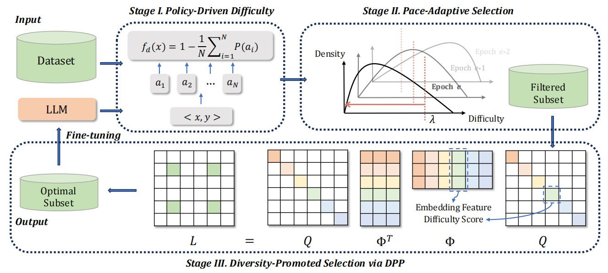

### Code for P3
论文地址: https://arxiv.org/abs/2408.05541 

该脚本使用各种选择策略进行训练，以优化训练过程，包括支持 SPL 和 DPP 等多样化的选择机制。

## Prerequisites
Before running the script, ensure you have the following installed:
- Python>=3.8
- PyTorch>=2.0.1
- Transformers
- datasets
- NumPy
- tqdm

## How to run 
python train.py --sort [排序类型] --select_num [选择数量] --epoch [训练轮数] --alpha [alpha 值]

- sort: 指定在训练期间用于排序或选择数据的方法, 可选值为 'random', 'total', 'policy_sampling_SPL', 和 'policy_sampling_SPL_DPP'
- select_num: 设置用于训练的选择或样本的数量, 默认值为 10,000
- epoch: 训练的轮数, 默认值为 5
- alpha: 影响在难度范围的控制

## 其他
1. 确保根据您的具体计算环境和数据集位置，适当设置脚本中的所有路径和配置。
2. 脚本可能需要调整参数或配置，以针对不同的数据集或训练条件进行优化。

## Citation
If you find this useful in your research, please consider citing
```
@misc{yang2024p3policydrivenpaceadaptivediversitypromoted,
      title={P3: A Policy-Driven, Pace-Adaptive, and Diversity-Promoted Framework for Optimizing LLM Training}, 
      author={Yingxuan Yang and Huayi Wang and Muning Wen and Weinan Zhang},
      year={2024},
      eprint={2408.05541},
      archivePrefix={arXiv},
      primaryClass={cs.CL},
      url={https://arxiv.org/abs/2408.05541}, 
}
```
